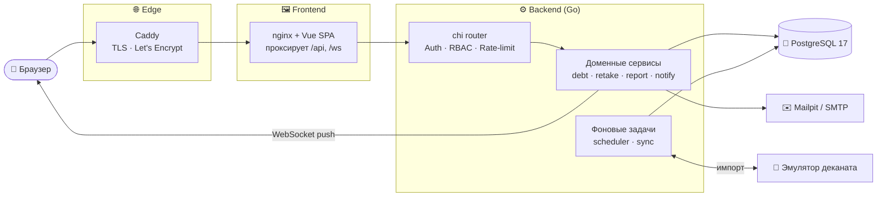
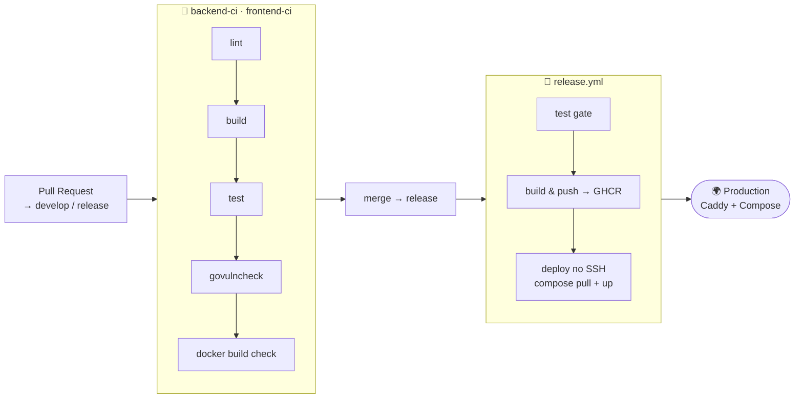

<div align="center">

# 🎓 Система учёта академических задолженностей

**Единое цифровое пространство для студентов, преподавателей и деканата — учёт долгов, пересдачи, ведомости и уведомления в реальном времени.**

[](https://github.com/MaximaRasskazov/Academic-debt-system/actions/workflows/backend-ci.yml)
[](https://github.com/MaximaRasskazov/Academic-debt-system/actions/workflows/frontend-ci.yml)
[](https://github.com/MaximaRasskazov/Academic-debt-system/actions/workflows/release.yml)


**🌐 Живой стенд**

[](https://academic.poluyanov.net)
[](https://mail.academic.poluyanov.net)

</div>

---

## 📑 Содержание

- [О проекте](#-о-проекте)
- [Возможности по ролям](#-возможности-по-ролям)
- [Архитектура](#-архитектура)
- [Технологический стек](#-технологический-стек)
- [Быстрый старт](#-быстрый-старт)
- [Демо-аккаунты](#-демо-аккаунты)
- [Структура репозитория](#-структура-репозитория)
- [API](#-api)
- [Качество и тестирование](#-качество-и-тестирование)
- [CI/CD и деплой](#-cicd-и-деплой)
- [Конфигурация](#-конфигурация)
- [Команда](#-команда)

---

## 🚀 О проекте

Платформа автоматизирует рутину учёта успеваемости: от появления академического долга до его закрытия оценкой на пересдаче. Всё движение данных проходит через единый домен с жёсткими гарантиями на уровне БД — лог не может оторваться от данных, дубли долгов невозможны, привилегии не повышаются «по ошибке».

Ключевые свойства системы:

- 🔐 **Безопасность по умолчанию** — JWT-сессии с one-use refresh и replay-detection, RBAC с защитой от privilege escalation, rate-limit на входе, security-заголовки.
- 🧾 **Полная аудируемость** — каждая мутация идёт в одной транзакции с записью в `audit_log` и `change_logs` (before/after JSONB).
- 🔔 **Уведомления в реальном времени** — WebSocket-push + брендированные email-письма + история уведомлений.
- 📊 **Отчётность для деканата** — сводки по долгам и пересдачам с экспортом в XLSX/CSV.
- 🔄 **Синхронизация с эмулятором деканата** — фоновый импорт студентов, групп и дисциплин.
- 🐳 **Production-ready инфраструктура** — атомарный релиз через GHCR + автоматический TLS от Let's Encrypt.

---

## 👥 Возможности по ролям

<table>
<tr>
<td width="50%" valign="top">

### 👨‍🎓 Студент
- Видит свои академические долги и их статус
- Отслеживает назначенные пересдачи и расписание
- Получает push- и email-уведомления о назначениях и оценках
- Личный кабинет: профиль, смена пароля, «Мои дисциплины»

</td>
<td width="50%" valign="top">

### 👨‍🏫 Преподаватель
- Видит должников по своим дисциплинам
- Создаёт долги и закрывает их оценкой (2–5)
- Подаёт заявки на обычные и комиссионные пересдачи
- Ведёт ведомости и запрашивает роль преподавателя

</td>
</tr>
<tr>
<td width="50%" valign="top">

### 🏛 Деканат
- Создаёт и ведёт пересдачи (обычные и комиссионные ≥3 преподавателей)
- Обрабатывает заявки: на пересдачи от преподавателей и на изменение времени/места
- Рассматривает заявки студентов на роль преподавателя
- Ведёт справочник дисциплин, выгружает аналитику (XLSX/CSV) и ведомости

</td>
<td width="50%" valign="top">

### ⚙️ Администратор
- Единственная задача — **управление ролями** пользователей
- Меняет роль (студент / преподаватель / деканат) на странице «Управление ролями»
- Защита от эскалации привилегий: нельзя выдать роль выше своего уровня
- Роль `admin` через UI не выдаётся

</td>
</tr>
</table>

---

## 🏗 Архитектура

Фронтенд (Vue SPA) и бэкенд (Go) живут на одном домене: nginx внутри фронт-контейнера раздаёт статику и проксирует `/api` и `/ws` на бэкенд, а Caddy спереди терминирует TLS.



### Архитектурные инварианты

Свойства, которые гарантируются на уровне БД и сервисов:

| Инвариант | Что гарантирует |
|---|---|
| **Unit of Work** | Любая мутация идёт через `RunInTx` с записью в `audit_log` + `change_logs` в той же транзакции |
| **One-use refresh** | Повторное использование refresh-токена ревокует все access-токены пользователя (разрыв сессии атакующего) |
| **Privilege escalation guard** | Нельзя выдать роль с уровнем выше своего: декан (700) не назначит admin (1000) |
| **UNIQUE как бизнес-правило** | Нельзя 2 открытых долга на одну дисциплину; запрещён спам заявок |
| **CHECK-constraints** | `debt='graded'` ⇒ оценка обязательна; `retake='commission'` ⇒ ≥3 преподавателей |
| **Soft-delete** | Дисциплины, роли, права не удаляются физически — на них есть FK-зависимости |

---

## 🛠 Технологический стек

| Слой | Технологии |
|---|---|
| **Backend** | Go 1.26 · [chi](https://github.com/go-chi/chi) v5 · [pgx](https://github.com/jackc/pgx) v5 · [sqlc](https://sqlc.dev) · [goose](https://github.com/pressly/goose) · JWT · bcrypt · slog |
| **Real-time / отчёты** | [coder/websocket](https://github.com/coder/websocket) · [excelize](https://github.com/xuri/excelize) (XLSX) · gomail (SMTP) · Prometheus `/metrics` · Swagger `/swagger` |
| **Frontend** | Vue 3 (`<script setup>`) · Vite 8 · Pinia · vue-router · axios · vue-datepicker · xlsx/docx · Vitest |
| **Данные** | PostgreSQL 17 · 24 миграции (goose) · типобезопасные репозитории (sqlc) |
| **Инфраструктура** | Docker / Compose · nginx · Caddy (TLS) · Mailpit · GHCR · GitHub Actions |

---

## ⚡ Быстрый старт

Полное поднятие стека одной командой:

```bash
make setup
```

Что произойдёт:

1. Создастся `.env` из `.env.example` (если его ещё нет).
2. Сгенерируется случайный `JWT_SECRET` (`openssl rand -hex 32`).
3. Поднимется `docker compose up -d --build` — Postgres, Mailpit и backend.
4. `entrypoint.sh` дождётся готовности Postgres, накатит миграции и (при `SEED_DEV_ACCOUNTS=true`) демо-аккаунты.

После запуска доступны:

| Сервис | Адрес |
|---|---|
| 🔌 Backend health | <http://localhost:8080/health> |
| 📖 Swagger UI | <http://localhost:8080/swagger/> |
| ✉️ Mailpit (письма) | <http://localhost:8025> |
| 🐘 PostgreSQL | `localhost:15432` · БД `academic_debts` · `academic`/`academic` |

Фронтенд в dev-режиме поднимается отдельно:

```bash
make frontend-up        # → http://localhost:5173
```

### Полезные команды

```bash
make help          # список таргетов
make logs          # tail-логи всех сервисов
make psql          # psql внутри контейнера postgres
make test          # интеграционные тесты backend
make down          # остановить (volumes остаются)
make reset         # полный сброс с подтверждением (volumes + .env)
```

> Backend-специфичные команды (`make run`, `make migrate-up`, `make sqlc`, …) — в [backend/README.md](backend/README.md).
> Frontend-команды — в [frontend/README.md](frontend/README.md).

### Требования

- Docker + Docker Compose
- `make`, `openssl` (для генерации `JWT_SECRET`)
- Для локальной разработки backend без Docker: Go 1.26+, `goose`, `sqlc`

---

## 🔑 Демо-аккаунты

При `SEED_DEV_ACCOUNTS=true` (по умолчанию в dev) сидятся **только** `admin` и `dean` — этих ролей нет в эмуляторе деканата, а без них некому залогиниться и запустить синхронизацию. Пароль у обоих — `password`.

| Email | Роль | Уровень |
|---|---|---|
| `admin@academic.local` | admin | 1000 |
| `dean@academic.local` | dean | 700 |

> 👨‍🎓 **Студенты и преподаватели не сидятся** — они целиком приходят из эмулятора деканата через `sync.Service` (см. [синхронизация](#-конфигурация)). На свежей БД без настроенного эмулятора их не будет.
>
> ⚠️ В production держите `SEED_DEV_ACCOUNTS=false`.

---

## 📂 Структура репозитория

```
.
├── backend/                  # Go-сервис (chi + pgx + sqlc + goose)
│   ├── cmd/server/           # точка входа: конфиг → пул → сервисы → router
│   ├── internal/
│   │   ├── config/           # загрузка .env, валидация
│   │   ├── repo/             # sqlc-репозитории + Store с RunInTx (UoW)
│   │   ├── service/          # домен: auth, rbac, debt, retake, report,
│   │   │                     #        notify, scheduler, sync, statement …
│   │   ├── emulator/         # клиент эмулятора деканата
│   │   └── transport/http/   # dto, handler, middleware, router_*.go
│   └── sql/                  # migrations/ (24) + queries/ + seeds/
├── frontend/                 # Vue 3 SPA (Vite, Pinia, vue-router)
│   └── src/
│       ├── api/              # axios-клиенты по доменам
│       ├── views/            # страницы по ролям (Student/Teacher/Dean/Admin …)
│       ├── components/       # переиспользуемые компоненты
│       └── stores/           # Pinia (auth, notifications, toasts)
├── docs/                     # проектная документация
├── docker-compose.yml        # dev-стек (postgres + mailpit + backend)
├── docker-compose.prod.yml   # прод-стек (GHCR-образы + Caddy)
├── Caddyfile                 # TLS + reverse-proxy для прода
├── Makefile                  # единая точка входа в задачи
└── .github/workflows/        # backend-ci · frontend-ci · release
```

---

## 🔌 API

Все защищённые эндпоинты требуют `Authorization: Bearer <jwt>` и проходят RBAC-проверку. Полный справочник с правами и семантикой — в **[backend/README.md → API endpoints](backend/README.md#api-endpoints)** и в живом **Swagger UI** (`/swagger/`).

| Группа | Базовый путь | Назначение |
|---|---|---|
| 🔐 Auth | `/api/auth/*`, `/api/me/*` | регистрация, логин, refresh, профиль, смена пароля |
| 👥 Users | `/api/users` | список пользователей с фильтрами (admin/dean) |
| 📚 Disciplines | `/api/disciplines/*` | справочник + привязка преподавателей/студентов |
| 📕 Debts | `/api/debts/*` | академические долги: создание, оценка, отмена |
| 🔁 Retakes | `/api/retakes/*` | пересдачи, участники, статусы, выставление оценок |
| 📝 Requests | `/api/retake-change-requests/*`, `/api/teacher-requests/*` | заявки на изменения и роли |
| 📊 Reports | `/api/reports/*` | сводки + экспорт XLSX/CSV |
| 🔔 Notifications | `/api/notifications/*`, `/ws/notifications` | история + real-time WebSocket |
| ❤️ System | `/health`, `/metrics`, `/swagger/*` | liveness, Prometheus, документация |

---

## ✅ Качество и тестирование

- **Backend** — интеграционные тесты против реального Postgres (`go test -race -cover`), 200+ тестов, покрытие ключевых сервисов 75–90%.
- **Frontend** — unit-тесты на Vitest (stores, утилиты форматирования и дат).
- **Линтинг и безопасность** — `gofmt`, `go vet`, `golangci-lint`, `govulncheck` в CI на каждый PR.

```bash
make test                       # интеграционные тесты backend
make -C backend test            # unit-тесты (интеграционные скипаются)
npm --prefix frontend test      # тесты фронтенда
```

---

## 🚢 CI/CD и деплой

Три GitHub Actions workflow покрывают весь путь от PR до прода:



- **`backend-ci` / `frontend-ci`** — на каждый push/PR: lint → build → test → security → проверка сборки Docker-образа.
- **`release.yml`** — на push в `release`: тест-гейт → сборка и публикация образов в **GHCR** → атомарный выкат по SSH (`docker compose pull && up`). Упавший тест останавливает свою ветку — образ не пушится, деплоя нет.
- **Прод** ([`docker-compose.prod.yml`](docker-compose.prod.yml)) — образы из GHCR, **Caddy** с автоматическим TLS (Let's Encrypt), ротация логов, healthcheck'и, Mailpit под basic-auth.

---

## ⚙️ Конфигурация

Единый источник конфига — корневой `.env` (создаётся из [`.env.example`](.env.example)). Его читают и Docker Compose, и `backend/Makefile`.

| Группа | Переменные |
|---|---|
| Application | `APP_ENV`, `APP_PORT`, `LOG_LEVEL` |
| PostgreSQL | `DB_HOST`, `DB_PORT`, `DB_NAME`, `DB_USER`, `DB_PASSWORD` |
| JWT / сессии | `JWT_SECRET` (≥32 байт), `ACCESS_TOKEN_TTL`, `REFRESH_TOKEN_TTL` |
| Cookie | `COOKIE_SECURE`, `COOKIE_DOMAIN`, `COOKIE_PATH`, `COOKIE_SAMESITE` |
| CORS | `ALLOWED_ORIGINS` |
| SMTP | `SMTP_HOST`, `SMTP_PORT`, `SMTP_USER`, `SMTP_PASSWORD`, `SMTP_FROM` |
| Синхронизация | `EMULATOR_URL`, `EMULATOR_API_KEY`, `SYNC_INTERVAL` |
| Dev | `SEED_DEV_ACCOUNTS` |

> Для прода см. [`.env.prod.example`](.env.prod.example) — там же переменные Caddy (`DOMAIN`, `ACME_EMAIL`, `MAIL_DOMAIN`, basic-auth Mailpit).

---

## 👨‍💻 Команда

| Участник | Роль |
|---|---|
| **Максим Рассказов** | Project Manager · System Analyst · Backend Developer |
| **Саян Исмагулов** | Frontend Developer (Vue.js) · UI/UX Designer |
| **Андрей Полуянов** | Backend Developer · DevOps |
| **Виталя Казаков** | Backend Developer |

---

<div align="center">

Сделано с ❤️ командой проекта · [Backend docs](backend/README.md) · [Frontend docs](frontend/README.md)

</div>
